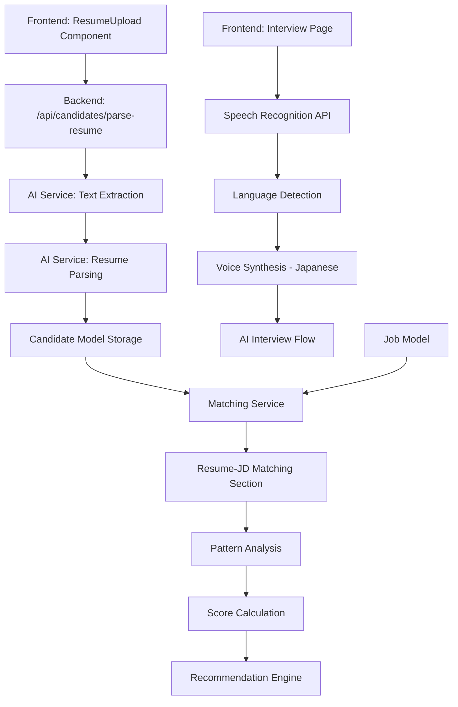

# Design Document: Resume Upload and Analysis

## Overview

This feature addresses three critical issues in the recruitment platform: fixing the broken resume upload functionality, adding Japanese language support for interviews, and creating a dedicated resume-JD matching section. The system will handle resume parsing, multi-language interview support, and comprehensive candidate-job matching with detailed analysis.

## Architecture



## Components and Interfaces

### Component 1: ResumeUpload (Frontend)

**Purpose**: Handle file upload, validation, and parsing status

**Interface**:
```typescript
interface ResumeUploadProps {
    onParsed: (data: ParsedResumeData) => void;
    language?: string;
}

interface ParsedResumeData {
    firstName: string;
    lastName: string;
    email: string;
    phone?: string;
    currentCompany?: string;
    currentTitle?: string;
    totalExperience?: number;
    skills: string[];
    languages?: string[];
    education?: Education[];
    certifications?: string[];
    parsedData: any;
    patterns?: PatternScores;
}

interface PatternScores {
    technicalAptitude: number;
    leadershipPotential: number;
    culturalAlignment: number;
    creativity: number;
    confidence: number;
    communicationSkill: number;
    problemSolvingAbility: number;
    adaptability: number;
    domainExpertise: number;
    teamworkOrientation: number;
    selfAwareness: number;
    growthMindset: number;
}
```

**Responsibilities**:
- File type validation (PDF, DOCX)
- File size limit enforcement (max 5MB)
- Upload progress tracking
- Error handling and user feedback
- Parsing status display
- Language selection for interviews

### Component 2: ResumeParser (Backend)

**Purpose**: Extract text from files and parse into structured data

**Interface**:
```typescript
interface ResumeParser {
    extractText(buffer: Buffer, mimetype: string): Promise<string>;
    parseResume(text: string, language?: string): Promise<ParsedResumeData>;
}
```

**Responsibilities**:
- PDF text extraction using pdf-parse
- DOCX text extraction using mammoth
- Resume parsing with AI service
- Multi-language support for parsing
- Error handling and fallback mechanisms

### Component 3: InterviewLanguageManager (Frontend)

**Purpose**: Manage language settings for interviews

**Interface**:
```typescript
interface InterviewLanguageManager {
    supportedLanguages: LanguageConfig[];
    currentLanguage: string;
    setLanguage: (lang: string) => void;
    getVoiceConfig: () => SpeechSynthesisVoice;
}

interface LanguageConfig {
    code: string;
    name: string;
    locale: string;
    voiceName?: string;
}
```

**Responsibilities**:
- Language selection UI
- Voice synthesis configuration
- Speech recognition language setting
- Japanese locale support

### Component 4: ResumeJdMatcher (Backend)

**Purpose**: Match candidate resumes with job descriptions

**Interface**:
```typescript
interface ResumeJdMatcher {
    match(candidate: Candidate, job: Job): MatchResult;
    calculateMatchScore(candidate: Candidate, job: Job): number;
    generateMatchAnalysis(candidate: Candidate, job: Job): MatchAnalysis;
}
```

**Responsibilities**:
- Vector similarity matching
- Keyword-based matching
- Pattern analysis integration
- Score calculation and ranking
- Detailed match analysis generation

### Component 5: ResumeJdMatchingSection (Frontend)

**Purpose**: Display comprehensive resume-JD matching analysis

**Interface**:
```typescript
interface ResumeJdMatchingSectionProps {
    candidate: Candidate;
    job: Job;
    matchResult: MatchResult;
}

interface MatchResult {
    overallScore: number;
    skillMatch: SkillMatch[];
    experienceMatch: ExperienceMatch;
    culturalFit: CulturalFit;
    recommendations: string[];
    concerns: string[];
}
```

**Responsibilities**:
- Score visualization
- Skill matching breakdown
- Experience alignment display
- Cultural fit analysis
- Actionable recommendations

## Data Models

### Model 1: ParsedResume

```typescript
interface ParsedResume {
    // Basic Information
    firstName: string;
    lastName: string;
    email: string;
    phone?: string;
    
    // Professional Details
    currentCompany?: string;
    currentTitle?: string;
    totalExperience?: number; // in months
    location?: {
        city: string;
        country: string;
    };
    
    // Skills & Qualifications
    skills: string[];
    languages?: string[];
    certifications?: string[];
    
    // Education
    education?: Education[];
    
    // Preferences
    expectedSalary?: number;
    salaryCurrency?: string;
    noticePeriod?: string;
    workPreference?: 'remote' | 'hybrid' | 'onsite' | 'flexible';
    
    // AI Analysis
    patterns?: PatternScores;
    embedding?: number[];
}
```

**Validation Rules**:
- Email must be valid format
- Phone must be valid international format if provided
- Skills array must not be empty
- Total experience must be non-negative
- Languages must be valid ISO 639-1 codes

### Model 2: MatchResult

```typescript
interface MatchResult {
    overallScore: number; // 0-100
    skillMatch: SkillMatch[];
    experienceMatch: ExperienceMatch;
    culturalFit: CulturalFit;
    recommendations: string[];
    concerns: string[];
    matchMethod: 'vector' | 'keyword' | 'hybrid';
}

interface SkillMatch {
    skill: string;
    candidateLevel: 'expert' | 'advanced' | 'intermediate' | 'beginner';
    jobRequirement: 'required' | 'preferred' | 'nice-to-have';
    matchScore: number;
}

interface ExperienceMatch {
    yearsRequired: number;
    candidateYears: number;
    match: boolean;
    gapAnalysis?: string[];
}

interface CulturalFit {
    vibe: string;
    alignmentScore: number;
    redFlags: string[];
    greenFlags: string[];
}
```

**Validation Rules**:
- Overall score must be 0-100
- Skill matches must have valid levels
- Experience match must have non-negative values
- Cultural fit red/green flags must be arrays

## Algorithmic Pseudocode

### Main Resume Parsing Algorithm

```pascal
ALGORITHM parseResume(file, language)
INPUT: file (PDF/DOCX), language (string, optional)
OUTPUT: ParsedResume

BEGIN
  // Step 1: Validate file
  IF file IS NULL THEN
    RETURN Error("No file provided")
  END IF
  
  IF file.type NOT IN ['application/pdf', 'application/msword', 
                       'application/vnd.openxmlformats-officedocument.wordprocessingml.document'] THEN
    RETURN Error("Invalid file type. Use PDF or DOCX")
  END IF
  
  IF file.size > 5MB THEN
    RETURN Error("File size exceeds 5MB limit")
  END IF
  
  // Step 2: Extract text
  text ← extractText(file.buffer, file.type)
  
  IF text IS EMPTY OR text IS NULL THEN
    RETURN Error("Failed to extract text from file")
  END IF
  
  // Step 3: Parse with AI
  IF language IS NOT NULL AND language ≠ 'en' THEN
    parsedData ← aiService.parseResume(text, language)
  ELSE
    parsedData ← aiService.parseResume(text)
  END IF
  
  // Step 4: Validate parsed data
  IF parsedData.skills IS EMPTY THEN
    RETURN Error("No skills detected. Please check resume quality")
  END IF
  
  // Step 5: Generate embedding
  profileText ← buildProfileText(parsedData)
  parsedData.embedding ← aiService.generateEmbeddings(profileText)
  
  // Step 6: Fetch patterns
  parsedData.patterns ← aiService.fetchStudentPatterns(text)
  
  RETURN parsedData
END
```

**Preconditions:**
- File is a valid PDF or DOCX document
- File size is within 5MB limit
- AI service is available and configured
- Language code (if provided) follows ISO 639-1 standard

**Postconditions:**
- Returns structured ParsedResume object
- Embedding vector is generated (may be empty if AI service unavailable)
- Patterns are calculated with scores 0-100
- All required fields are present or null

**Loop Invariants:**
- File validation ensures only supported types are processed
- Text extraction maintains document structure
- AI parsing preserves all extracted information

### Resume-JD Matching Algorithm

```pascal
ALGORITHM matchResumeToJob(candidate, job)
INPUT: candidate (ParsedResume), job (JobDescription)
OUTPUT: MatchResult

BEGIN
  // Step 1: Calculate vector similarity
  vectorScore ← 0
  IF candidate.embedding IS NOT EMPTY AND job.embedding IS NOT EMPTY THEN
    vectorScore ← cosineSimilarity(candidate.embedding, job.embedding) * 100
  END IF
  
  // Step 2: Calculate keyword score
  keywordScore ← calculateKeywordScore(candidate, job)
  
  // Step 3: Determine primary score method
  IF vectorScore > 0 AND keywordScore > 0 THEN
    overallScore ← (vectorScore * 0.7) + (keywordScore * 0.3)
    matchMethod ← 'hybrid'
  ELSE IF vectorScore > 0 THEN
    overallScore ← vectorScore
    matchMethod ← 'vector'
  ELSE
    overallScore ← keywordScore
    matchMethod ← 'keyword'
  END IF
  
  // Step 4: Calculate skill matches
  skillMatches ← []
  FOR EACH skill IN candidate.skills DO
    skillMatch ← findSkillInJob(skill, job)
    IF skillMatch IS NOT NULL THEN
      skillMatches.add(skillMatch)
    END IF
  END FOR
  
  // Step 5: Calculate experience match
  experienceMatch ← compareExperience(candidate, job)
  
  // Step 6: Calculate cultural fit
  culturalFit ← analyzeCulturalFit(candidate, job)
  
  // Step 7: Generate recommendations
  recommendations ← generateRecommendations(candidate, job, skillMatches)
  
  // Step 8: Identify concerns
  concerns ← identifyConcerns(candidate, job, skillMatches)
  
  RETURN MatchResult with all calculated values
END
```

**Preconditions:**
- Candidate has valid parsed data with skills
- Job has valid description with requirements
- Both candidates and jobs belong to the same organization

**Postconditions:**
- Returns comprehensive MatchResult object
- Overall score is weighted combination of vector and keyword scores
- Skill matches include level assessment
- Cultural fit includes red/green flags

**Loop Invariants:**
- All skill matches are calculated against job requirements
- Experience comparison uses consistent metrics
- Cultural fit analysis is objective and bias-free

### Japanese Language Support Algorithm

```pascal
ALGORITHM setupJapaneseInterview(language)
INPUT: language (string, e.g., 'ja-JP')
OUTPUT: InterviewConfiguration

BEGIN
  // Step 1: Validate language
  IF language ≠ 'ja-JP' THEN
    RETURN Error("Japanese language support only available for ja-JP")
  END IF
  
  // Step 2: Configure speech recognition
  recognitionConfig ← {
    lang: 'ja-JP',
    continuous: false,
    interimResults: false
  }
  
  // Step 3: Configure voice synthesis
  voiceConfig ← findJapaneseVoice()
  
  IF voiceConfig IS NULL THEN
    RETURN Error("No Japanese voice found. Install Japanese language pack.")
  END IF
  
  // Step 4: Set up AI prompts in Japanese
  aiPrompts ← loadJapanesePrompts()
  
  // Step 5: Configure UI language
  uiLanguage ← {
    greeting: '面接を開始します',
    listening: 'お話を聞いています...',
    speaking: 'AIが話しています',
    endInterview: '面接を終了する'
  }
  
  RETURN InterviewConfiguration with all settings
END

FUNCTION findJapaneseVoice()
  voices ← window.speechSynthesis.getVoices()
  
  // Priority order for Japanese voices
  FOR EACH voice IN voices DO
    IF voice.lang = 'ja-JP' AND voice.name.includes('Natural') THEN
      RETURN voice
    END IF
  END FOR
  
  FOR EACH voice IN voices DO
    IF voice.lang = 'ja-JP' THEN
      RETURN voice
    END IF
  END FOR
  
  RETURN NULL
END FUNCTION
```

**Preconditions:**
- Browser supports Web Speech API
- Japanese language pack is installed
- AI service supports Japanese prompts

**Postconditions:**
- Returns complete interview configuration
- Voice synthesis is properly configured
- UI elements are localized

**Loop Invariants:**
- Voice search follows priority order
- AI prompts are loaded before interview starts
- UI localization is complete

## Key Functions with Formal Specifications

### Function 1: parseResume()

```typescript
function parseResume(file: File, language?: string): Promise<ParsedResume>
```

**Preconditions:**
- `file` is a valid File object with type in ['application/pdf', 'application/msword', 'application/vnd.openxmlformats-officedocument.wordprocessingml.document']
- `file.size` ≤ 5MB
- `language` (if provided) follows ISO 639-1 format

**Postconditions:**
- Returns ParsedResume object with all required fields
- `parsedData.skills` array is non-empty
- `parsedData.embedding` is generated (may be empty array if AI unavailable)
- `parsedData.patterns` contains all 12 score metrics (0-100)

**Loop Invariants:**
- File validation prevents unsupported types
- Text extraction maintains document integrity
- AI parsing preserves all extracted information

### Function 2: matchResumeToJob()

```typescript
function matchResumeToJob(candidate: Candidate, job: Job): MatchResult
```

**Preconditions:**
- `candidate` has valid `parsedData` with `skills` array
- `job` has valid `requirements` and `niceToHave` arrays
- Both belong to the same organization

**Postconditions:**
- Returns MatchResult with `overallScore` 0-100
- `skillMatch` array contains all matching skills
- `experienceMatch` has valid years comparison
- `culturalFit` includes red/green flags

**Loop Invariants:**
- All skills are matched against job requirements
- Experience comparison uses consistent metrics
- Cultural fit analysis is objective

### Function 3: setupJapaneseInterview()

```typescript
function setupJapaneseInterview(language: string): InterviewConfiguration
```

**Preconditions:**
- `language` equals 'ja-JP'
- Browser supports Web Speech API
- Japanese voice is available

**Postconditions:**
- Returns InterviewConfiguration with all settings
- Speech recognition is configured for ja-JP
- Voice synthesis uses Japanese voice
- UI is localized to Japanese

**Loop Invariants:**
- Voice search follows priority order
- AI prompts are loaded before interview
- UI localization is complete

## Example Usage

### Resume Upload Flow

```typescript
// Frontend usage
const handleResumeParsed = (data: ParsedResumeData) => {
  // Store parsed data
  setParsedResume(data);
  
  // Show success message
  setStatus('success');
  
  // Enable matching section
  setMatchingEnabled(true);
};

// In component
<ResumeUpload 
  onParsed={handleResumeParsed}
  language={selectedLanguage}
/>
```

### Japanese Interview Setup

```typescript
// Configure Japanese interview
const config = setupJapaneseInterview('ja-JP');

// Initialize speech recognition
recognition.lang = config.recognitionConfig.lang;

// Configure voice synthesis
utterance.voice = config.voiceConfig;
utterance.lang = 'ja-JP';

// Use Japanese UI
greetingText = config.uiLanguage.greeting;
```

### Resume-JD Matching

```typescript
// Calculate match
const matchResult = matchResumeToJob(candidate, job);

// Display results
<div className="matching-section">
  <ScoreCard score={matchResult.overallScore} />
  <SkillMatchList matches={matchResult.skillMatch} />
  <ExperienceAnalysis match={matchResult.experienceMatch} />
  <CulturalFitAnalysis fit={matchResult.culturalFit} />
  <Recommendations items={matchResult.recommendations} />
</div>
```

## Correctness Properties

### Property 1: Resume Parsing Completeness

**Universal Quantification**: For all valid resume files, the parsing function produces a ParsedResume object with all required fields populated.

**Formal Statement**: 
∀file ∈ Files, file.type ∈ SupportedTypes ∧ file.size ≤ 5MB ⇒ 
∃parsed ∈ ParsedResume, isComplete(parsed)

Where `isComplete()` verifies all required fields are present.

### Property 2: Match Score Validity

**Universal Quantification**: For all candidate-job pairs, the match score is between 0 and 100.

**Formal Statement**:
∀candidate ∈ Candidates, ∀job ∈ Jobs ⇒ 
0 ≤ matchResumeToJob(candidate, job).overallScore ≤ 100

### Property 3: Japanese Language Isolation

**Universal Quantization**: Japanese interview configuration does not affect English interviews.

**Formal Statement**:
∀config ∈ InterviewConfigurations, 
if config.language = 'ja-JP' then config ≠ englishConfig

### Property 4: Pattern Score Bounds

**Universal Quantization**: All pattern scores are between 0 and 100.

**Formal Statement**:
∀parsed ∈ ParsedResume, ∀score ∈ parsed.patterns ⇒ 0 ≤ score ≤ 100

## Error Handling

### Error Scenario 1: Invalid File Type

**Condition**: User uploads a file with unsupported type
**Response**: Display error message "Invalid file type. Use PDF or DOCX"
**Recovery**: Allow user to select different file

### Error Scenario 2: File Size Exceeded

**Condition**: User uploads file larger than 5MB
**Response**: Display error message "File size exceeds 5MB limit"
**Recovery**: Allow user to compress and re-upload

### Error Scenario 3: Text Extraction Failure

**Condition**: AI service fails to extract text from file
**Response**: Display error message "Failed to extract text. Check file quality."
**Recovery**: Allow user to try different file or manual entry

### Error Scenario 4: Japanese Voice Not Found

**Condition**: No Japanese voice available in browser
**Response**: Display error message "Japanese voice not found. Install Japanese language pack."
**Recovery**: Provide English fallback or instructions for voice installation

### Error Scenario 5: Matching Service Unavailable

**Condition**: Matching service is temporarily unavailable
**Response**: Display warning "Matching service temporarily unavailable. Showing basic match."
**Recovery**: Use keyword-only matching as fallback

## Testing Strategy

### Unit Testing Approach

**Key Test Cases**:
1. Parse valid PDF resume
2. Parse valid DOCX resume
3. Reject invalid file types
4. Reject oversized files
5. Calculate match score for known pairs
6. Verify score bounds (0-100)
7. Test Japanese voice selection
8. Test pattern score calculations

**Coverage Goals**:
- 90% code coverage for parsing functions
- 85% coverage for matching algorithms
- 100% coverage for error handling paths

### Property-Based Testing Approach

**Property Test Library**: fast-check

**Properties to Test**:
1. **Resume Parsing Completeness**: For all valid files, output has all required fields
2. **Match Score Bounds**: All scores are between 0-100
3. **Pattern Score Bounds**: All pattern scores are between 0-100
4. **Vector Similarity Symmetry**: cosineSimilarity(A, B) = cosineSimilarity(B, A)
5. **Keyword Score Monotonicity**: More skill matches = higher score

### Integration Testing Approach

**Test Scenarios**:
1. Complete upload → parse → match workflow
2. Multi-language interview setup and execution
3. Resume-JD matching with various combinations
4. Error recovery flows
5. Performance under load (100+ concurrent uploads)

## Performance Considerations

**Requirements**:
- Resume upload: < 5 seconds for 5MB file
- Resume parsing: < 10 seconds (AI-dependent)
- Match calculation: < 2 seconds
- Japanese voice setup: < 1 second

**Constraints**:
- AI service calls may vary in response time
- Large files may take longer to upload
- Network latency affects AI service calls

**Optimization Strategies**:
- Implement upload progress indicators
- Cache AI parsing results
- Use web workers for heavy computations
- Implement graceful degradation for slow networks

## Security Considerations

**Requirements**:
- File type validation on both frontend and backend
- File size limits enforced
- AI service API key protection
- User data isolation (organization-scoped)

**Threat Model**:
- Malicious file uploads: Mitigated by type and size validation
- AI service abuse: Rate limiting and authentication
- Data leakage: Organization-scoped queries
- Cross-origin attacks: CORS configuration

**Mitigation Strategies**:
- Validate file types server-side
- Implement file scanning for malware
- Use environment variables for API keys
- Implement rate limiting on AI service calls
- Sanitize all user inputs

## Dependencies

**External Dependencies**:
- pdf-parse: PDF text extraction
- mammoth: DOCX text extraction
- OpenRouter API: AI resume parsing and pattern analysis
- Cartesia Voice API: Voice synthesis (for Japanese support)

**Internal Dependencies**:
- Candidate model: Resume data storage
- Job model: Job description storage
- Matching service: Score calculation
- AI service: Text extraction and parsing
- Authentication middleware: User authorization

**Version Requirements**:
- pdf-parse: ^2.0.0
- mammoth: ^1.6.0
- OpenRouter API: Latest stable
- Node.js: v18+